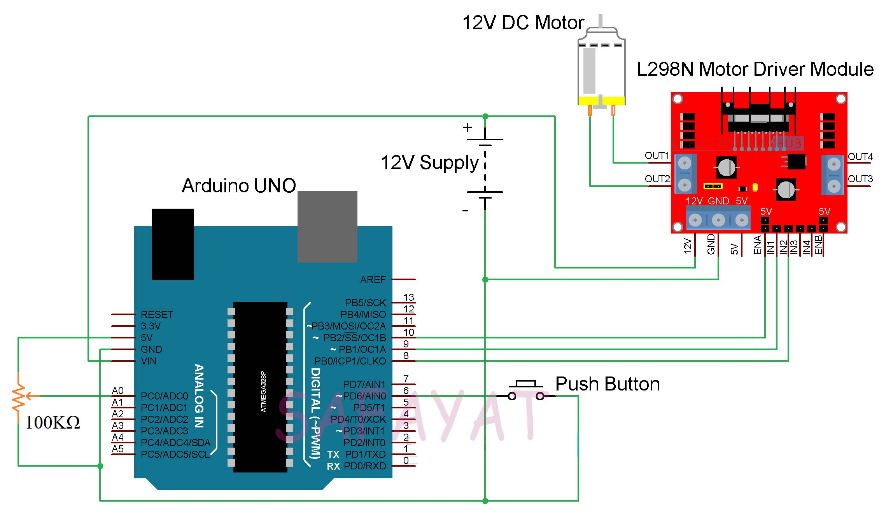

# dc-motor-controller
# Introduction :
There are different ways to control a DC Motor but the Arduino DC Motor Control using L298N Motor Driver is quite popular. Controlling a DC motor to rotate and in a particular direction is necessary for building robot or toy cars. There is a technique called PWM control that control the speed of rotation of a simple DC Motor.
# L298N Motor Driver : 
L298N Motor Driver IC is a 15-lead high voltage, high current Motor Driver IC with two full bridge drivers that can control two motors at the same time with individual inputs. The L298N Motor Driver Module consists of two 2-pin screw terminal blocks for connecting two motors. It also has six pin male headers for connecting the two enable inputs and the four input pins (two for each motor). There is a 3-pin screw terminal block to give the supply voltage to the motor.
# Apparatus : 
* Arduino Uno
* DC motor
* L298N Motor Driver
* Jumper Wires
# Schematics : 

# Code : 
[Code Link](DC_motor_controller.ino)
# Application : 
* Arduino DC Motor Control using L298N Motor Driver project can be the beginning step of many advanced projects. 
* Almost all robots have wheels and we need to control the motors connected to those wheels. Hence, any Arduino based robot can implement this type of motor control using L298N. 
* Some of the Robotic Applications of L298N Motor Driver are Hand Gesture Controlled Robot, Line Follower Robot, Obstacle Avoiding Robot, etc.

